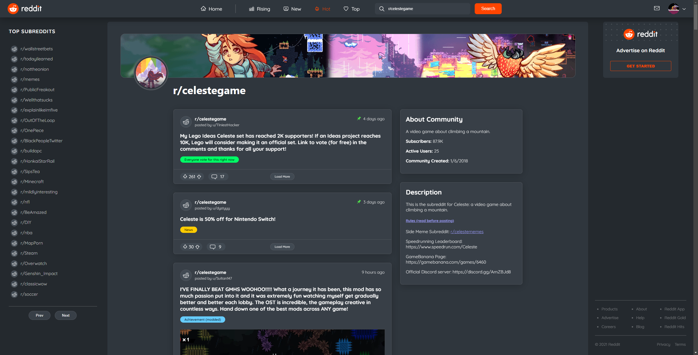

# Reddit Minimal

[](LICENSE)

## Description

This is Adrian Jimenez's minimal reddit client project.

This project is a feature rich, JSON API frontend built from scratch with react featuring viewing subreddits, posts, comments, and being able to navigate through a majority of what reddit has to offer. Included are both unit and e2e tests to ensure correct app behavior.

## Table of Contents

- [Installation](#installation)
- [Usage](#usage)
- [Contributing](#contributing)
- [License](#license)
- [Contact](#contact)

## Installation

In order to install this project, download all files and have node.js installed on your machine. Navigate to the root directory of the project and type:

```
npm install
```

Once all dependencies have been downloaded you can run start the application by typing:

```
npm start
```

## Technologies Used

- React
- Reddit JSON Api
- HTML & CSS
- React
- Redux
- Jest & React Testing Library
- Mock Service Worker

## Usage



In order to use this project, please make sure you have node.js installed on your machine. No authentication is required to use this app so once you install it on your machine you're good to go!

Alternatively, view the deployed application [here](https://main--gleaming-tartufo-562cbb.netlify.app/)

## Future Plans

These are future plans that I may develop on if there is interest in this project or I wish to polish it up more

- [ ] Make comments collapsible
- [ ] Embed links in comments
- [ ] Flairs in comments
- [ ] Add user page / link to user page in reddit
- [ ] Load more comments
- [ ] Share comments
- [ ] Local storage for icons
- [ ] Sessions
- [ ] Sort posts by time
- [ ] Add pfp to hamburger dropdown
- [ ] Test edge cases such as brand new subreddits
- [ ] Make each page scroll to top
- [ ] Refactor back button in search to return the user to the previous subreddit they came from (could use local storage?)
- [ ] Test if all components load skeletons
- [ ] Update markdown parser to render markdown better

## Contributing


This project follows the contributor covenant contribution guidelines. See [here](https://www.contributor-covenant.org/version/2/1/code_of_conduct/)

## License

This project is licensed under the [MIT License](LICENSE).

## Contact

If you have any questions or feedback, feel free to reach out to me at [adrianj.web@gmail.com](mailto:adrianj.web@gmail.com).
